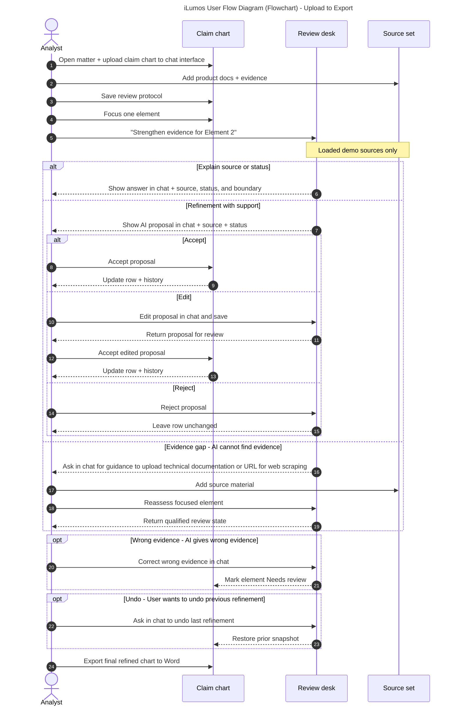

# iLumos assessment prototype

A browser prototype for the Lumenci AI Product Manager assessment. It demonstrates a source-grounded chat experience for refining a patent claim chart. iLumos proposes source-grounded changes; the analyst decides what enters the working chart.

## Decisions

Patent analysts already create claim charts, but strengthening the reasoning and evidence behind each claim element is slow and difficult to audit. Generic AI chat can also overstate what a source proves. iLumos makes refinement faster while keeping the analyst responsible for the legal conclusion: every suggestion is source-grounded, visibly provisional, and applied only after human review.

- Users would want to upload a claim chart, or request a refinement, or manual edits, or request a gap-filling analysis.
- Keep the chart and chat side by side: the analyst can see exactly which row is in context and verify the result without losing the source mapping.
- Treat AI output as a proposal: suggestions are never written automatically; accept, reject, edit, and undo make the human-in-the-loop boundary explicit.
- Separate disclosed fact from inference: citations are required, invented evidence is prohibited, and qualified language is used when a source suggests rather than proves an implementation.

## Assumptions

The initial experience is for one analyst in one matter. The assessment prototype uses the supplied Acme thermostat example and deterministic demo responses. Production would connect the same interaction model to retrieval, document parsing, source citations, and audit-grade versioning.

## User Flow

Legend: solid arrows = analyst action; dashed arrows = iLumos response; `alt` = review outcomes; `opt` = recovery paths.

## Run locally

Just open the `index.html` file in your browser.

## Demo path

1. Review the loaded claim chart and source documents.
2. Leave the default project instructions in place or edit and save them.
3. Use **Tighten the wording** or type: `The AI reasoning for the ML algorithm element is weak - add more technical details.`
4. Review the source-labelled suggestion and choose **Accept change**.
5. Ask `Undo the last refinement.` to demonstrate revision control.
6. Try **Why is this a gap?** and explain that the evidence is wrong to demonstrate the two evidence edge cases.
7. Use **Export to Word** to download a Word-compatible claim-chart draft.
